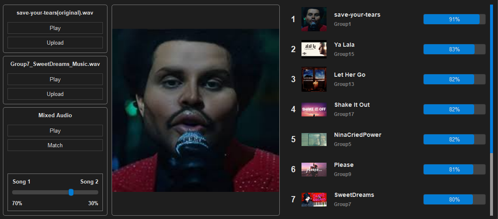

# Audio-Fingerprinting
Fingerprint-based music and vocals identification app that generates spectrograms, extracts features, applies perceptual hashing, and finds the most similar songs based on fingerprint matching.

<div align="center">
  
</div>

## Table of Contents
- [Prerequisites](#prerequisites)
- [Installation](#installation)
- [Features](#features)
- [Contributors](#contributors)

## Prerequisites

- Python 3.6 or higher

## Installation

1. **Clone the repository:**

   ``````
   git clone https://github.com/AhmedAmgadElsharkawy/Fingerprint.git
   ``````

2. **Install The Dependincies:**
    ``````
    pip install -r requirements.txt
    ``````

3. **Run The App:**

    ``````
    python main.py
    ``````

## Features

- **Spectrogram Generation**: The program iterates over songs in the shared folder, generating spectrograms for the full song, music, and vocals.

- **Feature Extraction**: For each spectrogram, key features are extracted, analyzed, and stored in a file. This allows for perceptual hashing to create a unique fingerprint for each song.

- **Perceptual Hashing**: Extracted features are hashed using perceptual hash functions to generate a compact representation of each song for easier identification.

- **Song Similarity Search**: Given any input sound file (song, vocals, or music), the program generates a spectrogram, extracts features, and compares it to the Database, outputting a sorted list of similar songs with a similarity index.

- **Weighted Average Song Mixing**: Users can select two files and control their contribution weight via a slider. The software then treats the combination as a new song and searches for similar songs in the Database, giving preference to the original files based on their similarity index.


## Contributors
- **AhmedAmgadElsharkawy**: [GitHub Profile](https://github.com/AhmedAmgadElsharkawy)
- **AbdullahMahmoudHanafy**: [GitHub Profile](https://github.com/AbdullahMahmoudHanafy)
- **MohamadAhmedAli**: [GitHub Profile](https://github.com/MohamadAhmedAli)
- **RawanAhmed444**: [GitHub Profile](https://github.com/RawanAhmed444)

